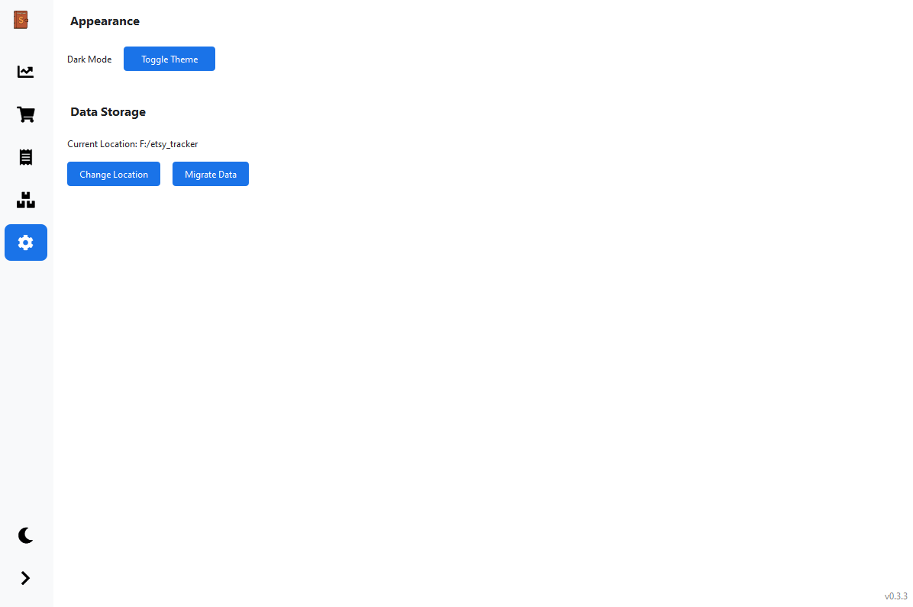

#  EtsyTrackr

[](https://github.com/Go2Engle/EtsyTrackr/releases)
[](https://github.com/Go2Engle/EtsyTrackr/actions)
[](https://github.com/Go2Engle/EtsyTrackr/blob/main/LICENSE)
[](https://www.python.org/downloads/)

⚠️ **WORK IN PROGRESS**: This application is actively being developed. Features and functionality may change without notice. Use at your own risk.

A desktop application to help Etsy sellers track their business finances, including sales, expenses, and profits.

## Platform Support

| Platform | Status | Notes |
|----------|--------|-------|
| Windows  | ✅ Tested | Primary development platform |
| macOS    | ⚠️ Untested | Build available but not verified |
| Linux    | ⚠️ Untested | Build available but not verified |

## Screenshots

### Dashboard

Real-time overview of your business performance with sales trends and expense breakdowns.

### Sales Tracking

Import and manage your Etsy sales statements with detailed breakdowns.

### Expense Management

Track your business expenses and manage receipts.

### Settings

Customize your application settings.

## About

This project was created to provide Etsy sellers with a simple, offline way to track their business performance without relying on the Etsy API. Instead of requiring API access or constant internet connectivity, it works directly with the monthly CSV statements that any seller can download from their Etsy Shop Manager.

### Why This Approach?
- No API keys or authentication needed
- Works offline once statements are downloaded
- No dependency on Etsy's API availability or rate limits
- Complete privacy - all data stays on your local machine
- Simple to use - just download your statements and import

## Features

### Dashboard
- Real-time overview of your business performance
- Daily sales chart with trend visualization
- Expenses breakdown showing Etsy fees vs. other business expenses
- Key metrics including:
  - Total sales and orders
  - Average order value
  - Net income
  - Total profit after expenses
  - Profit margin

### Sales Tracking
- Import Etsy CSV statements automatically
- Smart duplicate handling - keeps only the latest statement for each month
- View sales data with detailed breakdowns
- Filter by year and month
- Track shipping fees, taxes, and Etsy fees

### Expense Management
- Track business expenses with descriptions and dates
- Attach and view receipt images/PDFs
- Organize receipts with descriptive filenames (date_description_id)
- Filter expenses by:
  - Year
  - Month
  - Description search
- View expense statistics:
  - Total expenses in current view
  - Number of expenses

### Data Management
- Local data storage for privacy
- Automatic backup of sales and expense data
- Receipt file organization

## Installation

1. Ensure you have Python 3.8 or higher installed
2. Clone this repository
3. Install required packages:
```bash
pip install -r requirements.txt
```

## Building from Source

### Manual Build
To build the executable manually:

1. Install the required packages:
```bash
pip install -r requirements.txt
```

2. Run the build script:
```bash
python build.py
```

The executable will be created in the `dist` directory.

### Automated Builds
Executables are automatically built for Windows, macOS, and Linux when a new release is created on GitHub. These builds are attached to the release as assets and can be downloaded directly from the releases page.

Supported Platforms:
- Windows: `.exe` executable
- macOS: `.dmg` disk image
- Linux: `.AppImage` package

## Usage

1. Run the application:
```bash
python main.py
```

2. Import your Etsy statements:
   - Go to the Sales tab
   - Click "Import Statement"
   - Select your Etsy CSV file(s)

3. Add your business expenses:
   - Go to the Expenses tab
   - Fill in the expense details
   - Optionally attach a receipt
   - Click "Add Expense"

4. View your business performance:
   - Go to the Dashboard tab
   - Use the year/month filters to view different time periods
   - Monitor your sales trends and expenses

## Data Storage

- Sales data: Stored in CSV format
- Expenses: Stored in JSON format
- Receipts: Stored as original files with descriptive names
- All data is stored locally in the application directory

## Contributing

This is a work in progress. If you find bugs or have suggestions for improvements, please:
1. Open an issue
2. Describe the problem or enhancement
3. Include steps to reproduce if reporting a bug

## License

This project is licensed under a modified MIT License that explicitly prohibits commercial resale. While the software is open source and free to use, modify, and distribute, it **cannot** be resold by any third party.

Key points:
- Free to use
- Free to modify
- Free to distribute
- Free to use in personal or business contexts
- Cannot be resold commercially
- Cannot be included in paid packages/services

See the [LICENSE](LICENSE) file for the complete terms.
